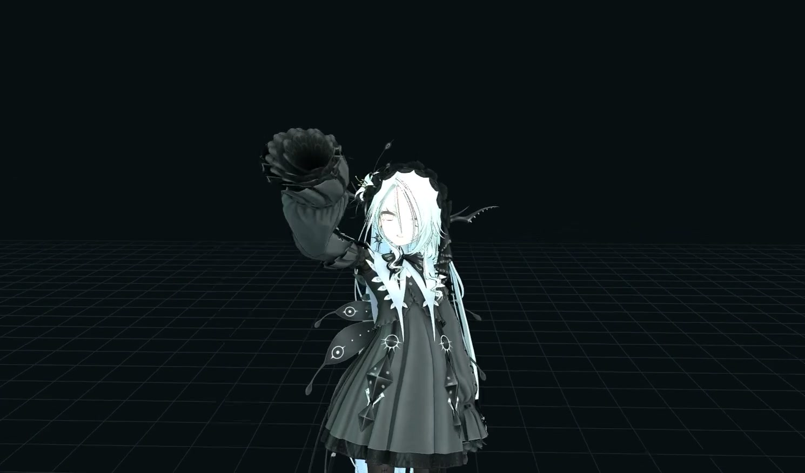

# Neural Avatar Pipeline

Neural Avatar Pipeline is a local Windows workspace for generating synchronized
speech, facial animation, and full-body character motion. The default pipeline
uses PocketTTS for the voice, LAM Audio2Expression for ARKit facial motion, and
both ARDY runtimes for body motion. A unified timeline can play the generated
tracks together and export the result as an MP4.

## Project introduction

Select the image to watch the avatar-generated project introduction. The video
was produced by Live Full Flow using the local control API and the included
reproducible storyboard.

The application is designed to run offline once its local runtimes, models, and
avatar have been supplied. Those large or separately licensed payloads are not
included in the Git repository.

## Default pipeline

| Stage | Component | Role |
| --- | --- | --- |
| Voice | PocketTTS 2.1.0, `anna` preset | CPU streaming speech synthesis |
| Face | LAM Audio2Expression | Audio-to-ARKit facial animation |
| Body, batch | ARDY Core-8 | Complete prompted motion clips |
| Body, live | ARDY Core-40 | Longer-horizon interactive motion |
| Text conditioning | Quantized LLM2Vec | Free-text and cached motion embeddings |
| Character | User-supplied VRM | Local preview and export target |

The interface has four persistent workspaces:

- **Facial Animation** generates or accepts speech, runs LAM, previews the
  facial track on the VRM, and exports facial animation with audio.
- **ARDY VRM Motion** creates batch or live body motion. It supports explicit
  timed prompt slots and permanently cached text embeddings.
- **Unified Character** schedules the latest face/voice and motion tracks at
  independent start times, previews them on one character, and exports the
  combined result as MP4.
- **Live Full Flow** keeps ARDY Core-40 running under WASD control while queued
  PocketTTS PCM streams through context-preserving GPU LAM windows and plays
  with synchronized facial animation on the same character. It includes independent cue loops,
  anatomical position and direction anchors, follow/orbit shots, and a local
  LLM control API.

## Hardware guidance and measured performance

The complete pipeline was tested on Windows 11 with an RTX 4090 (24 GB VRAM),
an i9-13900KF, and 64 GB system RAM. With the original CUDA PocketTTS baseline, LAM, both ARDY runtimes,
the browser renderer, and their models loaded, peak observed whole-device GPU
memory was **8,238 MiB**. The increase above the stopped desktop baseline was
**4,761 MiB**, and the project's loaded system-memory working set was
**6.025 GiB**.

Based on that measured peak and the headroom needed by Windows and the browser,
the practical recommendation is an NVIDIA CUDA GPU with **at least 12 GB of
VRAM**. An 8 GB GPU is not currently claimed as supported. Use at least **16 GB
of system RAM**; **32 GB or more** is recommended for comfortable operation
alongside the browser and development tools.

| Steady-state workload | Tested result |
| --- | ---: |
| Warm CPU speech + first synchronized LAM second | ~0.35 s component pipeline |
| CPU PocketTTS synthesis | 4.1–4.3× realtime |
| Streaming LAM window | ~30–50 ms median |
| ARDY Core-40, 7 denoising steps | 170 ms median; 11.94× realtime |
| Live session start to motion ready | 483.8 ms median |
| Export 32.49-second introduction | 37.01 s median |

The current speech figures are component/concurrency measurements for the new
CPU-streaming baseline; end-to-end browser TTFA will be remeasured with the next
full benchmark pass. The older published full-flow TTFA remains documented as a
historical baseline in [`BENCHMARKS.md`](BENCHMARKS.md). See
[`BENCHMARKS.md`](BENCHMARKS.md) for ranges, methodology, resource sampling,
additional ARDY configurations, and machine-readable results.

## Quick start

### Portable local bundle

1. Put an appropriately licensed VRM at `vnyan/Zome.vrm`, or update the local
   avatar configuration to point to another file inside the project.
2. Double-click `launch.bat`.
3. Keep the launcher window open while using the application at
   <http://127.0.0.1:8788/>.
4. To use the WebUI from another device on the same private network, run
   `enable-lan-access.bat` once and accept the administrator prompt. Restart the
   lab and open one of the `LAN WebUI` addresses printed by the launcher.
5. Close the launcher window or press `Ctrl+C` to stop every service it owns.

For the first-stage optimized runtime, launch with `launch-efficient.bat`
instead. Efficiency Mode is an explicit startup profile because its model
precision and compiler choices are made while the workers load. It currently:

- runs the LAM Audio2Expression model and its CUDA activations in FP16;
- omits LAM's unused per-layer Wav2Vec attention maps;
- keeps ARDY's fused PyTorch scaled-dot-product attention enabled and enables
  TF32 matrix multiplication on supported NVIDIA GPUs;
- preserves the existing 4-bit ARDY text encoder and direct cached-embedding
  path; and
- renders the VRM at native 1× pixel density without shadow maps or WebGL
  antialiasing, while updating spring-bone physics at 30 Hz.

The motion prompt, denoising, guidance, history, path, speech, and camera
controls are unchanged. Use `launch.bat` at any time to return to the measured
quality baseline. Efficiency Mode needs its own resource and quality benchmark
pass before a lower VRAM recommendation is published.

The portable ARDY environment includes the matching Windows Triton compiler,
but denoiser compilation is deliberately excluded from the default profile.
Core-40's changing live-history shapes caused an unacceptable first-horizon
compile stall. The remaining compile path is experimental and requires an
explicit `UNIFIED_EXPERIMENTAL_ARDY_COMPILE=1` environment override.

The LAN page provides the same four workspaces, live controls, audio playback,
exports, and control API as the host machine. All browser-facing service URLs
follow the hostname or IP address used to open the main WebUI, so another
machine does not accidentally call its own loopback interface. No account,
password, or access token is required; use it on a trusted private LAN.

The supplied launcher resolves paths relative to its own folder. A complete
local bundle can therefore be copied to another Windows location without
referring to the original Face, Voice, or Retargetting projects.

The populated local working tree contains three relocatable environments and
two bundled base interpreters entirely below `unified`. ARDY and PocketTTS use
small isolated overlays over a shared CUDA-enabled Python 3.12 base; LAM uses a
separate Python 3.10 environment. The launcher rewrites their environment
metadata after the folder moves. See [`DEPENDENCIES.md`](DEPENDENCIES.md) for
the exact portability contract.

Run `verify.bat` for a fast environment, package, and payload inventory. Run
`verify.bat --deep` when copying or archiving the bundle to SHA-256-check every
recorded model file. Verification does not start services or allocate GPU
models.

### Git source checkout

A Git clone contains the integration code, UI, configuration, documentation,
and small assets. It intentionally excludes model weights, Python and Node
installations, virtual environments, CUDA libraries, generated output, and VRM
avatars. To run a source checkout, populate the ignored runtime/model locations
with legally obtained copies of the upstream dependencies described in
[`THIRD_PARTY_NOTICES.md`](THIRD_PARTY_NOTICES.md).

The current launcher expects a Windows 10/11 x64 system with a compatible
NVIDIA GPU and display driver. The complete portable build carries its own
application-level Python, Node.js, FFmpeg, CUDA user-mode libraries, and model
payloads; the system GPU driver remains an external requirement.

## Basic workflow

### 1. Generate speech and a face track

Open **Facial Animation**. Enter text for Anna, upload audio, or record from a
microphone. Select **Generate LAM animation** to compute an ARKit expression
track. The preview includes adjustable eye, head, and mouth gains plus optional
natural gaze and blinking. Use **Export MP4** when a face-only render is wanted.

### 2. Generate body motion

Open **ARDY VRM Motion** and choose the batch or live runtime:

- Core-8 produces a complete clip from the route, duration, constraints, and
  prompt schedule.
- Core-40 supports the live-window workflow while preserving its own controls.

Timed prompts use explicit rows: a floating-point start time on the left and
either a free-text prompt or cached-embedding selector on the right. Add rows
with the plus button. Free-text rows are embedded independently before rollout.
With cached input enabled, each row references the selected saved embedding
directly and does not require the prompt text to remain in the input box.

### 3. Combine the tracks

Open **Unified Character** after both source clips exist. Give the face and body
tracks independent offsets. Two zero offsets start them together; for example,
a face offset of `0` and motion offset of `5.0` starts body motion five seconds
after the face/voice track. Preview the result, then export the composed viewport
and speech track as MP4.

### 4. Run the live full flow

Open **Live Full Flow** and use the embedding manager before starting a session:

1. Create permanent embeddings from exact motion prompts and optionally give
   each one a short nickname. Existing tensors are reused instead of recomputed.
2. Choose one embedding as the idle fallback.
3. Add any embeddings you want to swap between to the control stack.
4. Optionally add timed speech, embedding, and walk-path cues.
5. Start the live session, then use WASD to control locomotion.

Use **Export one pass MP4** to restart the live timeline from zero and record
the complete rendered viewport, including Anna's generated speech, LAM facial
animation, ARDY body motion, VRM rendering, and live camera changes. During an
export, each speech and embedding schedule runs once even if its loop toggle is
enabled. A looping walk path completes its return leg to origin once, then the
recording stops after the final scheduled work and queued speech have finished.
It keeps a short post-roll so the last face motion or camera move is not cut
off at the final syllable.
The downloaded file is normalized to H.264 video, AAC audio, constant 30 fps,
and web-friendly MP4 timestamps for reliable playback and social-media upload.

Up/Down moves the stack highlight. Right activates the highlighted embedding;
Left releases it, allowing the idle embedding to take over. Only one stack item
is active at a time because ARDY accepts one conditioning tensor per live
horizon. Nicknames can be changed without altering the saved tensor, and cache
entries can be permanently deleted from the manager.

An optional secondary idle embedding can alternate with the primary idle on a
user-selected timer. The pair advances only while no explicit expression is
active; scheduled expressions and arrow-key selections override it immediately,
and returning to idle restarts the pair from the primary pose. This provides a
gentle recurring conditioning reset without inserting a large pose change.

The three cue lists share a clock that begins when Core-40's first motion
horizon is ready—not while the model is warming up. A speech row has a start
time and spoken line. An embedding row has a start time and cached selection,
including an explicit return to idle. A walk-path row gives an arrival time and
an X/Z endpoint in metres relative to the session origin. Add as many rows as
needed with the plus buttons. Live routes use the same frame-indexed ARDY root
constraints as the ARDY planner. WASD temporarily switches to target-velocity
control; releasing it restores the scheduled constraint track. Manual
arrow-key embedding changes remain available between
scheduled cues.

The walk-path grid mirrors the ARDY route planner: click to add snapped
endpoints, or focus the grid and use WASD for 0.25-metre steps. Edit generated
arrival times and X/Z values in the rows below the grid. Arrival times are
calculated from segment distance and the current move-speed setting. Undo,
Clear, and Fit operate on the same endpoint list.

Speech, embeddings, and walking each have an independent loop toggle. Speech
rearms only its own timed lines after the scheduled speech queue finishes.
Embeddings repeat only their own timed selections. Walk-path looping adds a
dashed final leg back to origin and restarts only the path after origin is
reached; holding WASD postpones that path restart until manual control is
released. None of these loops resets the main session clock or either of the
other schedules.

Enter speech and press Enter or **Speak**. CPU PocketTTS streams Anna's audio in
one-second windows, context-preserving GPU LAM prepares each matching facial
segment, and playback begins as soon as the first synchronized window is ready
without stopping the live body-motion stream. Multiple submitted lines are
prepared in order and play sequentially. Scheduled lines enter this same
live queue at their cue times; they are not prerendered when the session starts.
New embeddings are intentionally created while the live session is stopped so
loading the text encoder cannot interrupt Core-40 replanning.

Core-40 produces rolling 40-frame horizons. **Horizon seam blend** smooths the
visual pose, root, and rotation handoff across a selectable number of frames
when a new horizon replaces the old one. It does not modify the generated
history or relax scheduled route constraints.

The live camera separates framing from facing. **Target** selects the point kept
in frame, while **Direction anchor** selects whether camera yaw stays fixed in
the world or turns with the avatar's face, torso, or averaged foot direction.
The yaw control becomes an offset around that selected direction. The Face,
Torso, and Full Body presets select matching face, torso, and feet anchors;
manual drag and auto orbit adjust the same relative offset.

### Local LLM control

The open Live Full Flow workspace can be directed through its JSON API from the
host or another LAN machine. Start with `GET http://<lab-host>:8788/api/control/schema`, inspect
`/api/control/state`, submit retry-safe commands to `/api/control`, and poll the
returned command ID for completion. The API covers sessions, speech, cached
embeddings, all three schedules and loop flags, bounded locomotion, and camera
framing with body-relative direction anchors. An OpenAPI 3.1 description is available at
`/api/control/openapi.json`. See [CONTROL_API.md](CONTROL_API.md) for the
complete agent workflow and examples.

## Local services

| Port | Service |
| --- | --- |
| 8788 | Unified application shell and control API |
| 8793 | ARDY motion UI and API |
| 8794 | Face API and MP4 export |
| 8795 | Facial Animation UI |
| 8796 | PocketTTS CPU streaming worker |
| 8797 | LAM Audio2Expression worker |

The launcher binds these ports on the host's network interfaces. The included
firewall helper allows them only on Windows networks marked **Private**.

The launcher refuses to adopt an unrelated or stale process already occupying
a required port. Model workers also watch the launcher that owns them so an
abnormal shutdown does not intentionally leave a model service behind.

## Repository layout

- `webui/` — unified four-workspace shell and live-flow controller
- `face_animation/` — LAM face UI, API, and worker adapter
- `retargetting/` — ARDY browser UI, scheduler, VRM playback, and local API
- `motion-models/` — ARDY worker, constraints, and generated motion interface
- `ardy/` — ARDY engine integration for both Core-8 and Core-40
- `launcher.mjs` / `launch.bat` / `launch-efficient.bat` — portable service supervisor and baseline/optimized entry points
- `requirements/` — exact Python base and overlay locks
- `setup-environments.ps1` — reconstructs local environments from the locks
- `dependency-manifest.json` — runtime, environment, and source revisions
- `payload-manifest.json` — model revisions, sizes, and SHA-256 fingerprints
- `DEPENDENCIES.md` — portable environment and rebuild structure
- `VALIDATION_PLAN.md` — next-stage quality, benchmark, and demo protocol
- `PROJECT_MAP.md` — service and data-flow map
- `THIRD_PARTY_NOTICES.md` — upstream licenses, attribution, and citations

`legacy/` exists only in the maintainer's local working copy and is ignored by
Git. It contains the facial drivers removed from the default pipeline.

## Branches

- `master` is the public default: PocketTTS + LAM + ARDY Core-8/Core-40.
- `raw` preserves the original multi-driver research workspace before the
  default pipeline was reduced.

## Avatar and model policy

No Zome VRM—or any other avatar—is distributed in this repository. The default
local filename is retained only as a configuration convention. Model weights,
voice assets, gated base models, and generated media remain subject to their
respective upstream terms. Review the notices before copying or distributing a
portable bundle.

## Attribution

The original Neural Avatar Pipeline integration code is licensed under the
[Apache License 2.0](LICENSE). That license does not replace the licenses or
terms of upstream source, model payloads, voices, or avatars.

This project integrates work from NVIDIA Toronto AI Lab, 3D AIGC, Kyutai,
McGill NLP, three.js, pixiv, and their contributors. License details, model
terms, pinned revisions, and publication citations are collected in
[`THIRD_PARTY_NOTICES.md`](THIRD_PARTY_NOTICES.md).
